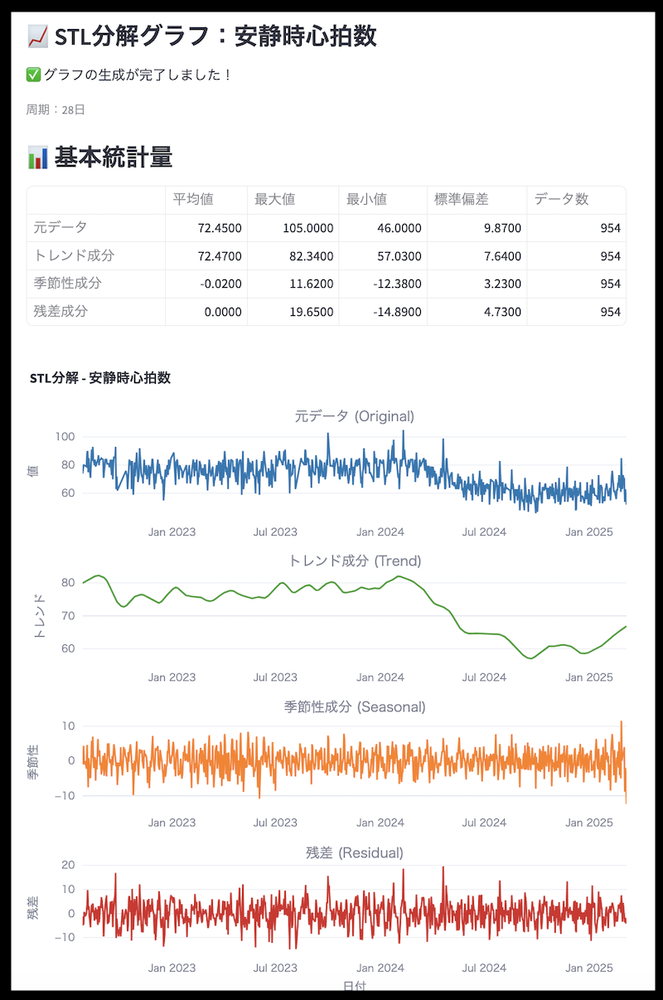
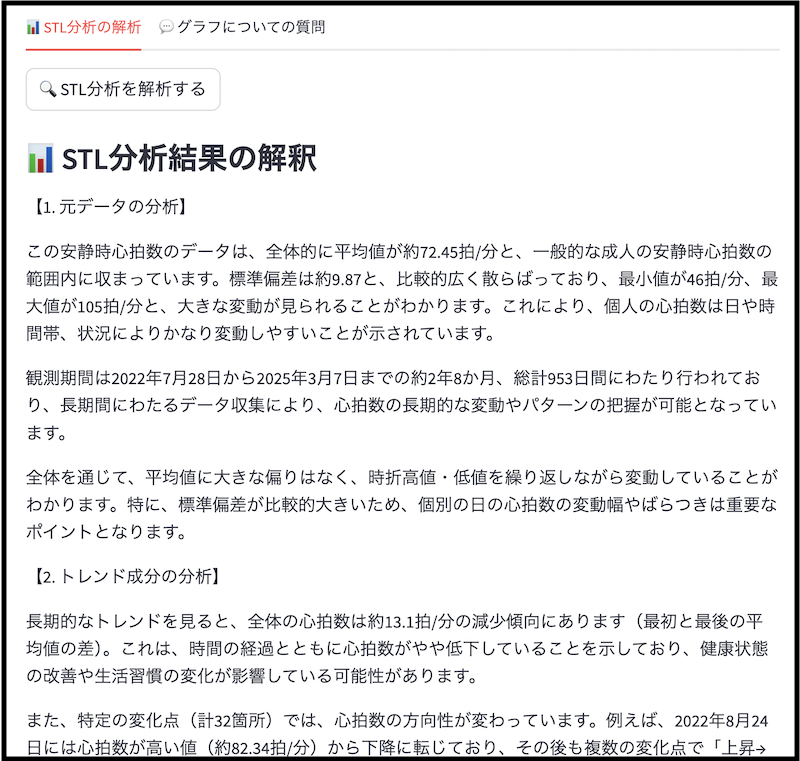
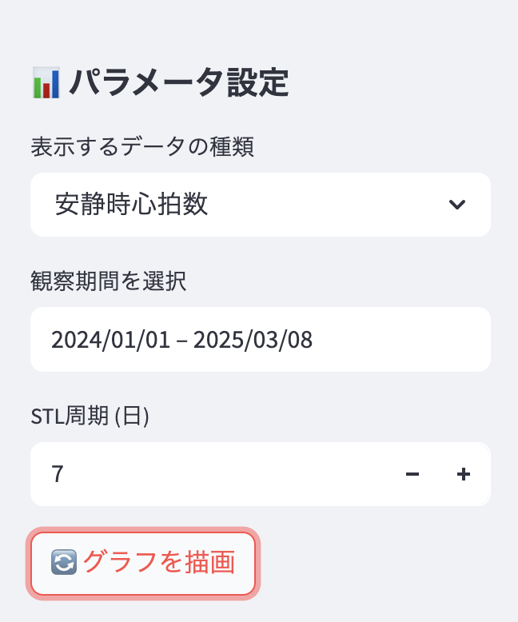

# ヘルスケアデータ可視化アプリ 📊

## 概要
このアプリケーションは、ヘルスケアデータを時系列分析（STL分解）を用いて可視化・分析するためのツールです。データのトレンド、季節性、残差を分析し、健康管理に役立つ洞察を提供します。

## スクリーンショット
### STL分析


### OpenAI apiを使ったデータ分析


## デモ
[Health_STL_analyzer](https://healthstlanalyzer-f9afa2q5qkbflrugizkeqv.streamlit.app/)

## 主な機能
- CSVファイルからのデータ読み込み
- STL分解による時系列分析
- インタラクティブなグラフ表示
- グラフのPNGダウンロード機能
- AIを活用したデータ分析（apiキーが必要です）
- チャットボットによる質問応答機能（apiキーが必要です）

## 必要条件
- Python 3.7以上
- OpenAI APIキー（AI分析機能を使用する場合）

## インストール方法
1. リポジトリをクローン：
```bash
git clone [リポジトリURL]
cd healthdata_visualizer
```

2. 仮想環境を作成して有効化：
```bash
python -m venv myenv
source myenv/bin/activate  # Unix/macOS
myenv\Scripts\activate     # Windows
```

3. 必要なパッケージをインストール：
```bash
pip install -r requirements.txt
```

## 使い方

### 1. アプリケーションの起動
```bash
streamlit run main2.py
```

### 2. データのアップロード
- アプリケーションにCSVファイルをアップロード
- CSVファイルには以下のカラムが必要：
  - `datetime`: 日時データ（タイムゾーン情報を含む）
  - `type`: データの種類
  - `value`: 測定値

データ例:

|datetime | type | value |
|:--------|:-----|:------|
|2020-10-27 21:35:26 +0900 | 消費カロリー | 410.753 |
|2020-10-27 23:42:37 +0900 | 基礎代謝 | 1287.901 |
|2020-10-28 21:11:40 +0900 | 消費カロリー | 432.91|

iPhoneの「ヘルスケア」データからCSVファイルを作成するためのツールを用意しておりますので、活用ください。
[apple_healthcare_converter](https://github.com/epsilonminder/apple_healthcare_converter)


### 3. パラメータの設定


サイドバーで以下の項目を設定：
- 表示するデータの種類
- 観察期間
- STL分解の周期（日数）

### 4. 分析機能の利用
- 「グラフを再描画」ボタンで表示を更新
- 「STL分析を解析する」ボタンでAI分析を実行
- チャットタブで質問を入力して詳細な分析を取得

### 5. グラフの保存
- 「グラフをPNGでダウンロード」ボタンでグラフを保存

## グラフの見方

### 1. 元データ（Original）
- 実際の測定値の推移を表示
- データの全体的な傾向を把握可能

### 2. トレンド成分（Trend）
- 長期的な変動傾向を表示
- 季節性を除いた本質的な変化を確認可能

### 3. 季節性成分（Seasonal）
- 周期的な変動パターンを表示
- 日々の生活リズムや週間パターンを確認可能

### 4. 残差（Residual）
- モデルで説明できない変動を表示
- 異常値や特殊なイベントの影響を確認可能

## 注意事項
- OpenAI APIキーは安全に管理してください
- 大量のデータを処理する場合は、処理に時間がかかる場合があります
- 欠損値の多いデータの場合、正しくSTL分解できない場合があります。
- 解析後に別のファイルを読み込む際、ファイルが更新されないことがあります。その際にはページを更新してやり直してください。

## ライセンス
このプロジェクトはMITライセンスの下で公開されています。
